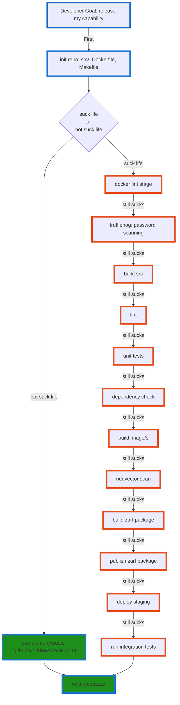

# dagger-dash-days

Dagger Pipeline Templates (`dpt`) is a cli tool that can be used local and in Git[Hub/Lab] pipelines alike.

## Goal

> Create a portable pipeline that could enable Developers to focus on what they're building. 
> 
> NOT on how to build/deploy/test/ATO/security-scan/all-the-things

We want to enable developers to leverage the Defense Unicorns ecosystem without becoming experts in it. 

## Quick Start

1. Copy github workflow to your project
```
cp dagger-dash-days/examples/github/main.yaml <YOUR-PROJECT>/.github/workflows/main.yaml
```

2. That's it... you're done. Just go write code.

### Okay, but really

All of the work is done in `dpt` the github workflow is just a simple wrapper to leverage it. The same would be true for a `gitlab-ci` or a `jenkinsfile`

If a project doesn't have a `zarf.yaml` file, `dpt` will let the developer know exactly what needs to happen... (in the future will create a `zarf.yaml` for them)

The Vision: dpt would have the BEST defaults for all the things. So that a developer can just write code and not worry about the rest. The pipeline stages would fail, but provide clear indicators and help to the developers on what needs to be done to fix it.

## What Pain are we solving?




## Just try it

```
cd test/pod-info && go run ../../main.go package create
```

## TODOs

- [x] go library and cli
- [x] inst  zarf.yaml
- [ ] detect zarf.yaml ? init zarf.yaml : be happy
- [x] zarf package create
- [x] Do it in a github pipeline
  - [x] `cp dagger-dash-days/examples/github/main.yaml <pod-info>/.github/workflows/main.yaml`
- [ ] Do it in a gitlab pipeline
  - [ ] `cp dagger-dash-days/examples/gitlab/main.yaml <pod-info>/.gitlab-ci.yaml`
- [ ] expand use cases, maybe integrate buildpacks???
- [ ] Use Ironbank images
- [ ] Use Zarf registry (runtime)
- [ ] Publish Zarf Package
- [ ] Deploy Package (easy user configuration for target environment)
- [ ] Make the CLI better (better output, logging, help, etc....)